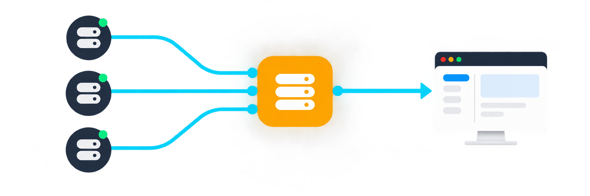

<p align="center">
  
</p>

<h1 align="center">Proxy Port Manager</h1>

<p align="center">
  把多个 Mihomo / Clash 节点，变成一个稳定、可观察的本地代理端口。
</p>

<p align="center">
  简体中文 · <a href="README_EN.md">English</a>
</p>

<p align="center">
  <a href="https://github.com/992640451/mihomo-local-proxy-pool/actions/workflows/ci.yml"></a>
  <a href="https://github.com/992640451/mihomo-local-proxy-pool/releases/latest"></a>
  <a href="LICENSE"></a>
  <a href="https://github.com/992640451/mihomo-local-proxy-pool/stargazers"></a>
  
</p>

<p align="center">
  <a href="#3-分钟启动"><strong>3 分钟启动</strong></a> ·
  <a href="#第一次使用"><strong>第一次使用</strong></a> ·
  <a href="#如何让应用使用代理"><strong>接入应用</strong></a> ·
  <a href="#常见问题"><strong>常见问题</strong></a>
</p>

---

```text
多个订阅节点  ──►  127.0.0.1:17900  ──►  浏览器 / 爬虫 / 开发工具
                    固定本地入口
```

你的应用只需要记住一个本地端口。节点选择、故障切换、健康检查和轮询都由 Proxy Port Manager 与 Mihomo 完成。

## 为什么使用它

| 固定入口 | 自动调度 | 看得见、可验证 |
| --- | --- | --- |
| 节点变化时，应用里的代理地址不用改 | 节点失败后自动跳过，支持 5 种策略 | 浏览器管理端口池，一键检测监听与出口分布 |

适合本地开发、爬虫、自动化工具或任何需要稳定 HTTP / SOCKS5 代理入口的应用。

> [!IMPORTANT]
> 本项目只管理你有权使用的订阅，不提供代理节点。默认仅监听 `127.0.0.1`，定位是单机、本地代理池，不是公网代理服务。

## 3 分钟启动

### 1. 准备环境

- Git
- Node.js 22 或更高版本
- Docker Desktop，或 Docker Engine + Compose

Windows 用户请确认 Docker Desktop 正在使用 Linux containers。

### 2. 安装并启动

```bash
git clone https://github.com/992640451/mihomo-local-proxy-pool.git
cd mihomo-local-proxy-pool
npm run init
docker compose up -d --build
```

`npm run init` 会创建本机专用的 `.env`、随机密钥和管理员密码。请保存终端中显示的密码；密码不会写入仓库。

### 3. 打开管理页面

访问 **http://127.0.0.1:4173**，使用初始化时显示的账号和密码登录。

检查服务是否正常：

```bash
docker compose ps
curl http://127.0.0.1:4173/healthz
```

看到 `status: ok` 即表示管理服务已经就绪。

## 第一次使用

1. 打开左侧 **订阅**，填写订阅 URL，或粘贴 Mihomo / Clash YAML。
2. 打开 **代理端口**，点击 **新建端口池**。
3. 使用端口 `17900`，协议选择 `Mixed`，再选择至少一个节点。
4. 保存后点击 **检测**；显示“Listener 可连接”即表示端口可用。
5. 点击端口旁的复制按钮，把代理地址粘贴到需要代理的应用中。

想使用轮询时，选择至少两个节点，并把策略改成 **轮询均衡**。轮询只对新连接生效，已建立的 TCP 连接不会在节点之间迁移。

## 如何让应用使用代理

假设已经创建 Mixed 端口 `17900`：

### 命令行

```bash
# HTTP / HTTPS
curl --proxy http://127.0.0.1:17900 https://api.ipify.org

# SOCKS5，并让代理端解析域名
curl --proxy socks5h://127.0.0.1:17900 https://api.ipify.org
```

Windows PowerShell 可把 `curl` 替换为 `curl.exe`。

### 环境变量

```text
HTTP_PROXY=http://127.0.0.1:17900
HTTPS_PROXY=http://127.0.0.1:17900
ALL_PROXY=socks5h://127.0.0.1:17900
```

浏览器、IDE、下载器和爬虫通常也支持直接填写代理地址：主机使用 `127.0.0.1`，端口使用你创建的端口。

## 如何确认轮询生效

1. 为端口池选择至少两个健康节点。
2. 策略选择 **轮询均衡** 并保存。
3. 在端口列表点击 **验证**。
4. 系统会建立 8 个独立连接，并显示成功率、出口 IP 分布和平均延迟。

出现多个出口 IP，通常说明轮换已经生效。不同节点也可能共用同一公网出口，因此只有一个出口 IP 不一定代表轮询失败；请同时查看节点健康状态和 Mihomo 日志。

## 策略怎么选

| 策略 | 适合场景 | 行为 |
| --- | --- | --- |
| 手动选择 | 只想固定使用一个节点 | 始终使用指定节点 |
| 主备切换 | 稳定性优先 | 主节点失败后按顺序切换 |
| 延迟优选 | 速度优先 | 自动选择当前延迟较低的节点 |
| 稳定哈希 | 希望相同目标尽量走相同节点 | 按目标稳定分配节点 |
| 轮询均衡 | 希望新连接分散到多个节点 | 按连接轮换健康节点 |

自动策略只使用通过健康检查的节点。节点不足、端口超出范围或订阅更新移除了节点时，服务会拒绝保存并说明原因。

## 核心功能

- 导入订阅 URL 或粘贴 Mihomo / Clash YAML。
- 原生加密订阅存储，刷新失败时保留最后一个可用版本。
- 创建 HTTP、SOCKS5 或 Mixed 本地端口池。
- 健康检查、自动跳过故障节点和 Mihomo 热重载。
- 端口 Listener 检测与多连接出口分布验证。
- 会话、订阅和端口池持久化，容器重建后仍可恢复。
- 可选迁移 Clash Verge 远程订阅。

## 它如何工作

```text
本机应用
   │ HTTP / SOCKS5
   ▼
127.0.0.1:17900 ──► Mihomo 策略组 ──► 健康节点 ──► 互联网
                           ▲
                           │ 本机 Controller API
浏览器 ──► 127.0.0.1:4173 ─┘
```

Compose 默认发布 `17891-17893` 和 `17900-17999`。如果启动时报端口占用，请检查整个范围。

## 常用命令

```bash
# 查看状态
docker compose ps

# 查看日志
docker compose logs -f --tail=100

# 更新到最新代码
git pull --ff-only
docker compose up -d --build

# 停止服务但保留数据
docker compose down
```

不要随意运行 `docker compose down -v`，它会删除订阅、会话和端口池数据。

### 忘记管理密码

```bash
npm run init -- --reset-password
docker compose up -d --force-recreate proxy-port-manager
```

该命令只重置管理员凭据，不会更换订阅加密密钥。

## 数据与安全

- `.env` 包含本机密钥，已被 Git 忽略，请勿分享。
- 订阅 URL、原始 YAML 和节点敏感字段使用 AES-256-GCM 加密后写入 SQLite。
- 默认 Compose 只绑定 `127.0.0.1`；不要在没有额外认证和网络隔离时改成 `0.0.0.0`。
- `proxy-session-data` 保存订阅、会话和端口池；`proxy-mihomo-data` 保存 Mihomo 运行配置。

安全问题请按 [SECURITY.md](SECURITY.md) 私下报告。

## 从 Clash Verge 迁移

新安装不依赖 Clash Verge。如果需要导入 Clash Verge 的远程订阅，请阅读 [Docker 部署文档](DOCKER.md)。迁移完成后应切回默认的原生订阅模式。

## 常见问题

<details>
<summary><strong>代理端口可以连接，但出口没有变化</strong></summary>

轮询针对新连接。关闭连接复用，或使用多个独立 `curl` 进程测试；同时确认至少两个节点通过健康检查。

</details>

<details>
<summary><strong>端口没有监听</strong></summary>

运行 `docker compose ps` 和 `docker compose logs mihomo-core`。确认端口位于已发布范围，并且没有被其他程序占用。

</details>

<details>
<summary><strong>初始化提示 .env 已存在</strong></summary>

这是防止误覆盖密钥的保护。已有安装不需要重新初始化；如果只是忘记密码，请使用 `npm run init -- --reset-password`。

</details>

<details>
<summary><strong>容器重建后数据会丢失吗？</strong></summary>

不会。默认使用 Docker volumes 持久化。除非你显式删除 volumes，否则 `docker compose down` 和重新构建镜像不会删除数据。

</details>

## 开发

```bash
npm ci
npm test
npm run build
npm run dev
```

更多内容： [Docker 部署](DOCKER.md) · [变更记录](CHANGELOG.md) · [贡献指南](CONTRIBUTING.md) · [安全政策](SECURITY.md)

## 项目状态

当前是早期版本，专注单机、本地代理池。公网代理、多租户、计费和分布式调度不在当前范围内。

如果这个项目对你有帮助，欢迎点一个 Star，让更多需要本地代理池的人看到它。

## 许可证

[MIT License](LICENSE)
